<!--more-->

## Vulkan layer demand:

1.	支持 dump api log
2. trace API（systrace），systrace 写到函数里，通过配置文件读取要 trace 哪些函数，比如 ALL/List，其实就是在合适的位置 Begin() End() 一下，学一下 ATRACE_CALL()/_INT()，然后用 chrome 查看
3.	支持统计每个 renderpass 的顶点，drawcall，需要获取每个drawcall的顶点数量，然后统计一下每一个renderpass的顶点数量
4.	统计每个 drawcall 的一些状态例如 depth test，stencil write， blend 等等信息，格式例如
5. 需要 layer 统计游戏的 memory 使用情况，主要是统计 device memory，vkGetBufferMemoryRequirements and vkGetImageMemoryRequirements to get and accumulate the total size，调研一下看看能统计出哪些类型的 memory，比较基础的 buffer， image 这种应该是没问题的，我们发觉有些游戏的vk 版本比 GL 版本 memory多，这个功能能帮忙分析

|  num   | depthfunc | BlendState | StencilState | DepthTest | DepthWrite | StencilWrite | ColorWrite | Discard | 
|  ----  |  ----  |  ----  |  ----  |  ----  |  ----  |  ----  |  ----  |  ----  |
| 0 | GL_GEQUAL | BS 0 | SS 0 | DT 1 | DW 1 | SW 1 | CW1111 | discard 0

5. 在桌面上写一个客户端窗口，可以控制和同步显示上面获取的信息

## Dump API Log

1. 注意宏的作用范围，报 undeclared
2. VkInstance -> VkInstance_T，可以看到这几个 struct 的第一个成员都是 dispatch，在同一条 dispatch chain 上的指针是相同的

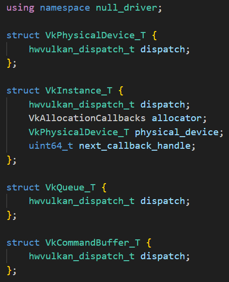

1. 写了一段函数测试 `GetKey()`，发现 GetKey 返回的是首位成员 hwvulkan_dispatch_t 的指针，但是没有很理解为什么先要做一次 (VkDevDispatchTable**) 的转换，好像是说 `(void *)` 可以存储任何类型的数据，因为我们用的 dispatch table 和 vulkan 自定义的不太一样，所以先强制转换成对应的二级指针然后解引用返回 `(void*)` 指针。大概这样一个关系：vtblA 是一个指向 x 的指针，它被记录在了 hwvulkan_dispatch_t 中 -> A 是一个指向 VkInstance_T 的指针，指针的第一个成员是 hwvulkan_dispatch_t，即指向 x 的指针 vtblA，那么指针 A 从一定程度上来说，可以理解为 vtblA 的二级指针，因为 A 指向一个结构，这个结构的第一个成员指向 vtblA -> A 指针本来是 `VkInstance_T`，转成了 `void*` 传入了 GetKey 函数 -> 将 A 指针转成二级指针（这一步没有很明白，但反正这个指变成了指向 vtblA 的指针）目前是指向 vtblA 的指针 -> 解引用一层，然后强制转换为 `void*`，返回值就是 vtblA 指针本身 -> 这个函数的作用就在于拿到了变量的第一个成员的值

```C++
#include <cstdint>
#include <iostream>

typedef std::uintptr_t binder_uintptr_t;

typedef union {
    uintptr_t magic;
    const void* vtbl;
} hwvulkan_dispatch_t;

struct VkPhysicalDevice_T {
    hwvulkan_dispatch_t dispatch;
};

struct VkInstance_T {
    hwvulkan_dispatch_t dispatch;
    VkPhysicalDevice_T physical_device;
    uint64_t next_callback_handle;
};

struct VkDevDispatchTable
{
    int GetDeviceProcAddr;
};

static void* GetKey(void* obj)
{
    VkDevDispatchTable** tablePtr = (VkDevDispatchTable**)obj;
    return (void*)*tablePtr;
}

int main() {
    int x = 5;
    int y = 6;
    const void* vtblA = (void*)&x;
    hwvulkan_dispatch_t disA = {};
    disA.vtbl = vtblA;
    hwvulkan_dispatch_t disB = {};
    disB.magic = y;
    VkDevDispatchTable disC = {};
    VkInstance_T* A = new VkInstance_T();
    A->dispatch = disA;
    VkInstance_T* B = new VkInstance_T();
    B->dispatch = disB;
    auto a = GetKey(A);
    auto b = GetKey(B);
}
```

- pthread_mutex_lock()函数锁住由mutex指定的mutex 对象。如果mutex已经被锁住，调用这个函数的线程阻塞直到mutex可用为止
- 模板的特化需要在模板的使用之前声明和定义，模板的全特化需要放到 .cpp 里面
- 出现头文件找不到的问题，一定要注意是否写上 target_include_directories，#include 的位置也要考虑，如果有循环引用的情况，可以放到后面
- 在写 layer 的时候，vkGet\*Pro/vkCreate\* 等一定都要捕获，否则就会直接 crash
- 需要捕获的函数，在 vkGet\*Pro 里面捕获后，在 vkCreate\* 里面需要设置对应的 table 找到下一层的函数指针，然后在自己的函数中执行完命令后跳转到下一层命令
- 由于文件涉及到读写权限，需要在 app 的 folder 下写。查看 renderdoc capture 之后，会写文件 .rdc 到 /data/media/0/Android/media/appname/files/RenderDoc/

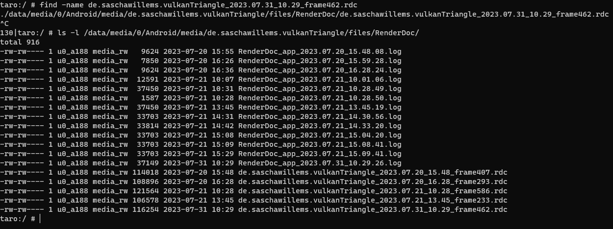

- 然后我想测试打开 PBR app 看看能否写文件到 Triangle app，会失败，查看两个目录的权限，发现每个 app 文件夹的 owner 和 group 都是一个 identical id，可能是对应的 app，然后看我运行 PBR 时候创建的文件 dumpAPI.txt，它的 owner 和 group 与其他的文件相同，因此可以推测，.so 加载进来之后所属的 app 进程会绑定一个 identical key，然后该进程的读写用的身份与 app 相同，那么在实际运行过程中，我们需要获取当前运行的 app 名称然后找到目录

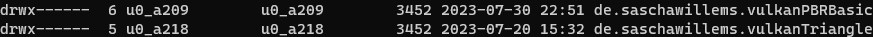

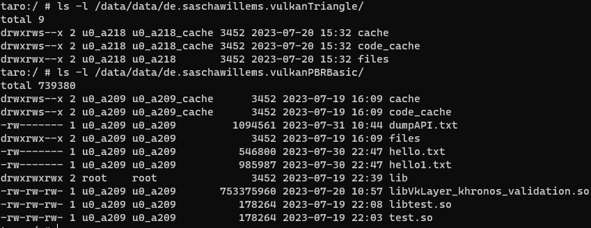

- 发现这个函数在做我想要的事情，获取当前运行的 app name，首先我运行我的 app 看了一下 pid，然后 cat 这个 /proc/\*/cmdline，能看到输出了 app name，所以这段代码应该主要就是在做这个事情

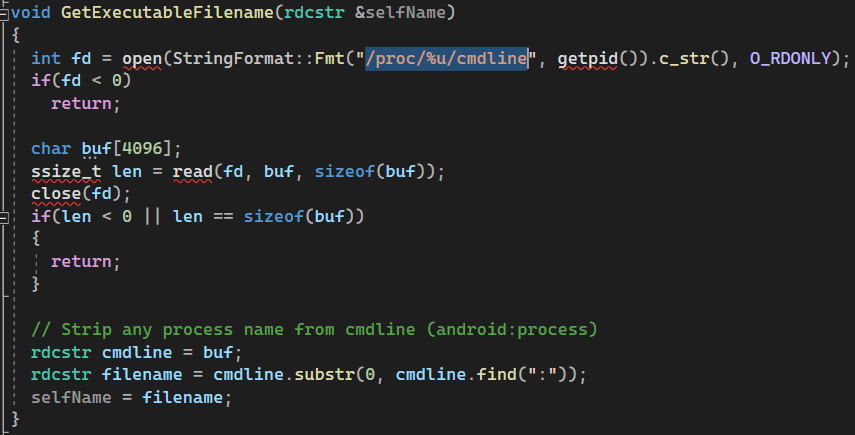

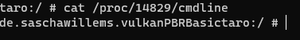

- 把这个 file pull 到 PC 上，用记事本打开，VScode打开乱码，应该是 android 的文件编码不一致，可以看到其实就是存了一个 app name，那么在实际的代码中只需要读到这个文件中的内容就可以了

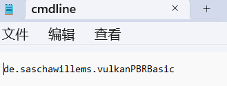

- 测试发现在 search layer 的时候会加载一次 .so，然后运行之后 load layer 还会加载一次 .so，但第二次关掉 app 似乎并没有看到调用了析构，这里可能会存在内存泄漏

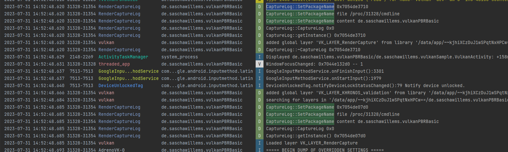

- 读这个文件的时候，遇到一些问题，似乎是文件本身是二进制的，导致读出来的结果有问题，所以拼接出来的 path 也不对，解决方法是读取单个 char 检查是否 valid，不存在就给 string 加上 '/0' 强制结束。同时进程好像没办法新建目录，目前是把文件存到目录 `/sdcard/Android/data/packagename/files/` 下面了
- 发现一些函数 CreateInstance，Enumerate 等不走 dispatch table，直接可以读，但 发现 Destroy Instance/Device 在程序结束的时候不会被调用

## renderpass

- 现在能捕获 CmdDraw 统计顶点个数，但具体怎么获取顶点自身的数据不太清楚，感觉需要记录 buffer 中绑定的数据和 layout 才能解析

- 发现一个性能问题，换上我的 layer 之后帧率从 60 fps 降到了 20 fps，然后 validation layer 和 renderdoc layer 都可以维持到 45 fps 左右，推测还是加锁太多和一直在写文件造成的
- 测试了一下不写文件，帧率变成了 50 多左右，那么性能损耗主要就是由于写文件太频繁导致的，虽然我没有实时 flush 而是结束之后直接 close，但可能因为每帧调用的接口很多，导致内存中记录了很多东西要写，就自动 flush 了
- 同时因为我记录的时候用了 `>> std::endl`，其中官方文档中说 `endl: Inserts a new-line character and flushes the stream`，所以其实每次都 flush 了，这性能肯定就受到影响了，把换行符改成 `\n` 就不会自动 flush 了，但这样子帧率也就只到了 30fps，注释掉 `GetDeviceDispatchTable` 里的 dump 指令帧率可以达到 52 fps，而注释掉 `GetInstanceDispatchTable` 里的 dump 帧率只有 30 fps，那么实际上和我去掉 `endl` 的结果是差不多的，而且用 `pubsetbuf` 尝试去扩大 stream buffer 的 size，帧率也没有提高，因此可以看到性能瓶颈主要就是在 `GetDeviceDispatchTable` 在实时绘制过程中调用太频繁，导致要写很多东西，那么这里就只能后面去参考 RenderDoc 抽象出每帧的概念，不要实时去写
- 记一下加上我的 layer 之后带上 endl 基准帧率是 26 fps，不带 endl 基准帧率是 30 fps，改了 buffer size 还是 30 fps，不写文件是 53 fps，和其他 layer 差不多，加上写文件是 45 fps 左右
- 之前的多线程写得有些问题，每次调用写函数都会启线程，导致开销过大，帧率只有 15 fps，现在改成单独一个线程从 queue 里拿数据，帧率只有 24 fps，并且还会闪退
- 发现最大的性能损耗是 Android Log! 注释掉之后立马变成 40 多 fps 了
- 多线程 crash 的原因我看出现在 hook_vkBeginRenderPass，但它做的只是调用了 dispatchtable，注释掉 queue.push 是能 work 的，感觉是消息队列写的有些问题

## vertex data

- 记录 buffer、memory 相关的数据，commandbuffer 绑定的 pipeline 得到 layout，绑定的 vertexbuffer、indexbuffer
- 在 cmdraw 和 cmddrawindex 根据 layout 解析 buffer 中的数据
- 测试检查一下，demo 中打个断点看看数据，比对 log，是一致的，但就是因为数据很多，帧率直接到 0 fps，这个问题需要解决

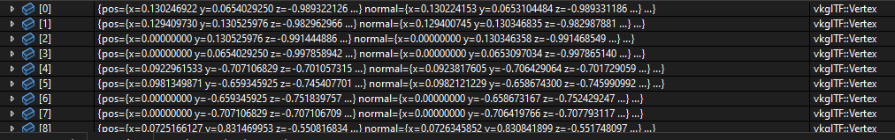


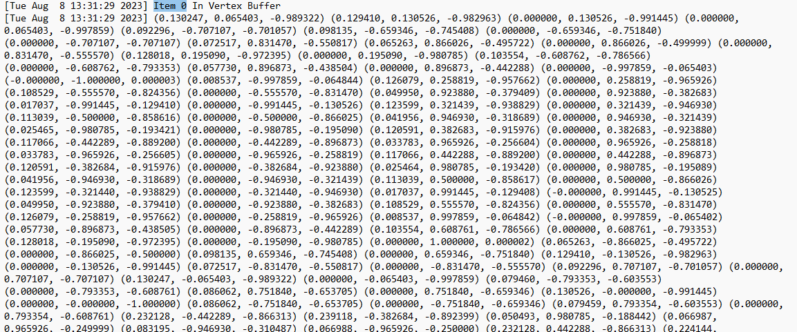

- char* new 完要记得 delete
- 测试发现我加上这个 std::vector<std::vector<uint32_t>> indexTest(indexCount / 3, std::vector<uint32_t>(3)) 就算什么操作也不做，帧率也会直接下降到 1 fps，改为数组操作可以提升性能
- 单独统计每个 draw call、renderpass、commandbuffer 的顶点数量，比较发现结果正确，本来担心 renderpass 之间会不会乱序执行，但是通过打 log 看 renderpass end 之后才会 begin 下一个 renderpass

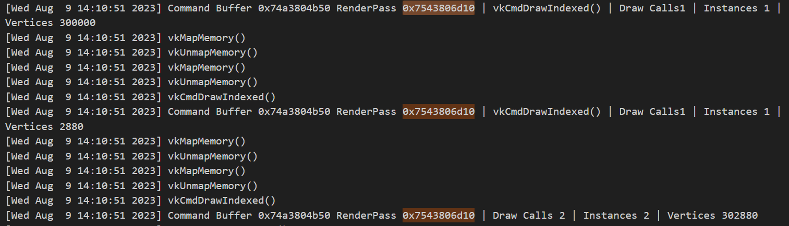

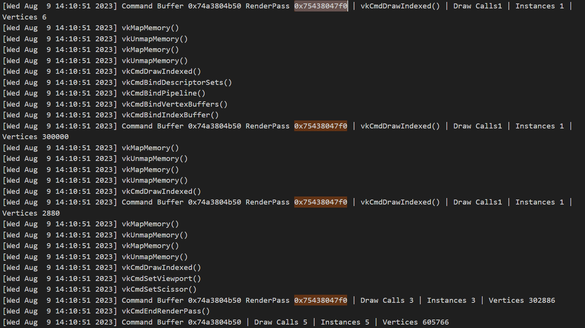

## Game

- 在 dumping vkBindBufferMemory() 之后黎明觉醒会 crash，报错是 Failed to attach thread and errno is 1 pid is 26308，关掉写文件，能正常启动，后面需要解决写文件的问题，难道是写得太多了？但是不是有缓存吗。还是说我 dump 传入的数据有问题，导致写文件崩溃了？
- stack corruption detected (-fstack-protector)
- FCompression::appUncompressMemoryOodle - Failed to uncompress memory (14282/21888), this may indicate the asset is corrupt!
- 我本来以为是要写入的时间有问题，所以直接 dumpAPIOutFile << "[]"，但是程序会直接崩溃，好奇怪呀
- 崩铁的 log 是 ok 的，怎么感觉绘制的顶点数也不是很多

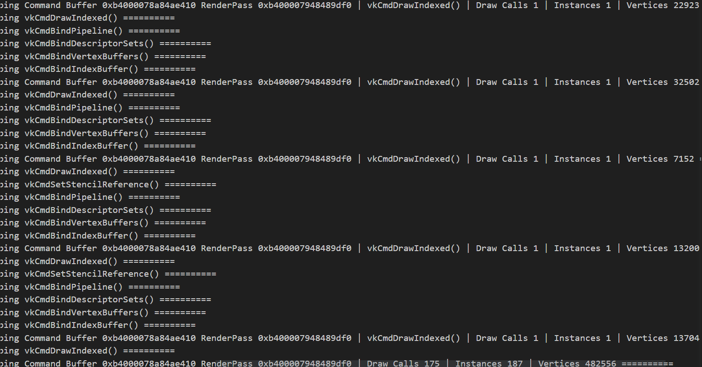

- 写文件崩溃是因为单线程写数据太多了，要改用多线程，多线程在使用的时候要注意引用的指针是否没有了，要确定线程函数结束的时间
- std::ctime(&end_time) 会降低帧率 10，所以只在主线程获取 std::time_t，在工作线程里解析，可以恢复帧率至 48 左右
- 把三个功能 dump 的文件分别写在一个文件夹下面，分别搞了四个 worker 线程，一个 mask manager 主线程

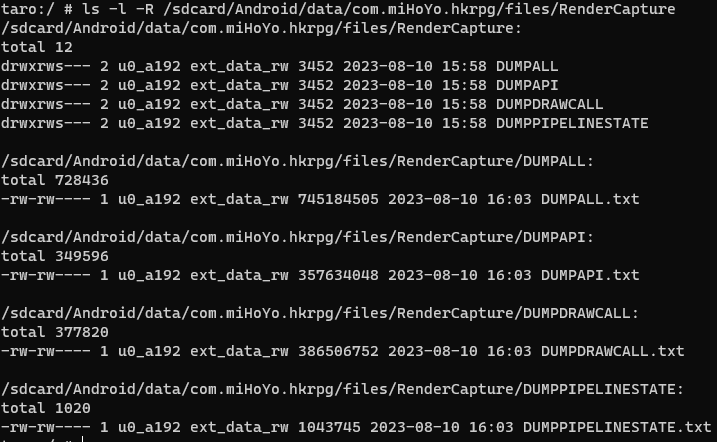

- 我试了一下要加#define ATRACE_TAG ATRACE_TAG_GRAPHICS，python3 record_android_trace.py -t 10s -b 32mb sched freq idle wm gfx hal  input -a com.miHoYo.Yuanshen，指令里面有这个gfx就可以了抓到了
- vkGetFenceStatus, vkCmdClearAttachments
- -DCMAKE_TOOLCHAIN_FILE=C:/vcpkg/scripts/buildsystems/vcpkg.cmake

# 使用 VK_LAYER_RenderCapture

## 1. 将 layer 和配置文件拷贝到正确的目录下

```shell
# 拷贝 layer 和配置文件到手机文件系统下
adb push ./libVkLayer_RenderCapture.so /data/local/tmp
adb push ./setting.json /data/local/tmp

# 拷贝 layer 到游戏的 lib/arm64/ 目录下
cp /data/local/tmp/libVkLayer_RenderCapture.so ${game_lib_folder}
# e.g.
cp /data/local/tmp/libVkLayer_RenderCapture.so /data/app/~~U-65uUgirPlu7cUYNx8c0w==/com.miHoYo.hkrpg-jGSsgdzSUJiYDe4YUNByIA==/lib/arm64/
```

## 2. 开启 layer 和 Perfetto

```shell
# 开启 layer
adb shell setprop debug.vulkan.layers VK_LAYER_RenderCapture

# 开启 Perfetto
adb shell setprop persist.traced.enable 1
```

## 3. 使用 layer 和 Perfetto

```shell
# layer 会自动被 vulkan 识别和加载

# 使用 Perfetto 
adb shell perfetto -o ${perfetto_output_path} -t ${time} -a ${game_name}
# e.g.
adb shell perfetto -o /data/misc/perfetto-traces/trace_file.perfetto-trace -t 60s -a com.miHoYo.hkrpg
```

## 4. 读取 Perfetto 的数据

```shell
# 拉取文件并使用 https://ui.perfetto.dev/ 或者其他方式读取
adb pull ${perfetto_output_path} ${path}
# e.g.
adb pull /data/misc/perfetto-traces/trace_file.perfetto-trace ./
```

## 5. 读取 layer dump 的数据

```shell
# 查看 layer 存放 dump 数据的文件夹
ls -l /sdcard/Android/data/${game_name}/files/RenderCapture/
# e.g.
ls -l /sdcard/Android/data/com.miHoYo.hkrpg/files/RenderCapture/

# 找到文件夹名字上时间最新的一个文件夹，即为最新一次测试产生的 dump 数据，可以拉取到 PC 上读取
adb pull /sdcard/Android/data/${game_name}/files/RenderCapture/${time_DUMP folder}/ ${path}
# e.g.
adb pull /sdcard/Android/data/com.miHoYo.hkrpg/files/RenderCapture/20230817104449_DUMP/ ./
```

# 配置文件说明

```json
{
    "SYSTRACE": {
        "TRACE_TYPE": "TRACELIST"/"TRACEALL", // "TRACELIST" 表示只 trace "TRACE_LIST" 里面的函数；"TRACEALL" 表示 trace 所有的 Vulkan API
        "TRACE_LIST": [ // 在 "TRACE_TYPE" 为 "TRACELIST" 时会被读取，用来指定需要 trace 哪些函数，需要写全函数名字并且带上 "()"
            "vkCmdDrawIndexed()",
            "vkCreateInstance()",
            "vkCreateGraphicsPipelines()"
        ]
    },
    "HOOK": {
        "ENABLED": false/true // 是否打开 layer 中的 draw call 分析功能，避免分析功能影响实际的 Vulkan API 执行时间。true - 打开；false - 关闭
    }
}
```

# DUMP 文件说明

- `DUMPAPI` 文件夹下记录的是 Vulkan API 被调用的时间
- `DUMPDRAWCALL` 文件夹下记录的是 draw call 的统计数据，统计了每个 renderpass 和 drawcall 的顶点数量
- `DUMPPIPELINESTATE` 文件夹下记录的是每次创建 GraphicsPipeline 时设置的 Depth、Stencil、ColorBlend 的参数
- `DUMPALL` 文件夹下把上述三种数据记录在了一起，方便查看执行的先后顺序

# 测试 & 编译环境（参考）

不能确保在所有版本和机器上都能使用，我使用的测试机：

- Model: Taro for arm64
- Android version: 12

编译环境：

- Java 17.0
- Android NDK 25.1.8937393
- Android ABI arm64-v8a
- Android native API level 23


## 小结

## References