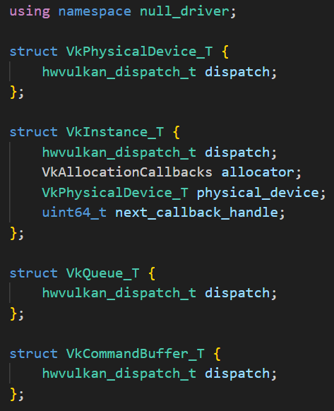

<!--more-->

## Vulkan layer demand:

1.	支持 dump api log， trace API（systrace）
2.	支持统计每个 renderpass 的顶点，drawcall
3.	统计每个 drawcall 的一些状态例如 depth test，stencil write， blend 等等信息，格式例如

|  num   | depthfunc | BlendState | StencilState | DepthTest | DepthWrite | StencilWrite | ColorWrite | Discard | 
|  ----  |  ----  |  ----  |  ----  |  ----  |  ----  |  ----  |  ----  |  ----  |
| 0 | GL_GEQUAL | BS 0 | SS 0 | DT 1 | DW 1 | SW 1 | CW1111 | discard 0

4. 在桌面上写一个客户端窗口，可以控制和同步显示上面获取的信息

## Dump API Log

1. 注意宏的作用范围，报 undeclared
2. VkInstance -> VkInstance_T，可以看到这几个 struct 的第一个成员都是 dispatch，在同一条 dispatch chain 上的指针是相同的



1. 写了一段函数测试 `GetKey()`，发现 GetKey 返回的是首位成员 hwvulkan_dispatch_t 的指针，但是没有很理解为什么先要做一次 (VkDevDispatchTable**) 的转换，好像是说 `(void *)` 可以存储任何类型的数据，因为我们用的 dispatch table 和 vulkan 自定义的不太一样，所以先强制转换成对应的二级指针然后解引用返回 `(void*)` 指针。大概这样一个关系：vtblA 是一个指向 x 的指针，它被记录在了 hwvulkan_dispatch_t 中 -> A 是一个指向 VkInstance_T 的指针，指针的第一个成员是 hwvulkan_dispatch_t，即指向 x 的指针 vtblA，那么指针 A 从一定程度上来说，可以理解为 vtblA 的二级指针，因为 A 指向一个结构，这个结构的第一个成员指向 vtblA -> A 指针本来是 `VkInstance_T`，转成了 `void*` 传入了 GetKey 函数 -> 将 A 指针转成二级指针（这一步没有很明白，但反正这个指变成了指向 vtblA 的指针）目前是指向 vtblA 的指针 -> 解引用一层，然后强制转换为 `void*`，返回值就是 vtblA 指针本身 -> 这个函数的作用就在于拿到了变量的第一个成员的值

```C++
#include <cstdint>
#include <iostream>

typedef std::uintptr_t binder_uintptr_t;

typedef union {
    uintptr_t magic;
    const void* vtbl;
} hwvulkan_dispatch_t;

struct VkPhysicalDevice_T {
    hwvulkan_dispatch_t dispatch;
};

struct VkInstance_T {
    hwvulkan_dispatch_t dispatch;
    VkPhysicalDevice_T physical_device;
    uint64_t next_callback_handle;
};

struct VkDevDispatchTable
{
    int GetDeviceProcAddr;
};

static void* GetKey(void* obj)
{
    VkDevDispatchTable** tablePtr = (VkDevDispatchTable**)obj;
    return (void*)*tablePtr;
}

int main() {
    int x = 5;
    int y = 6;
    const void* vtblA = (void*)&x;
    hwvulkan_dispatch_t disA = {};
    disA.vtbl = vtblA;
    hwvulkan_dispatch_t disB = {};
    disB.magic = y;
    VkDevDispatchTable disC = {};
    VkInstance_T* A = new VkInstance_T();
    A->dispatch = disA;
    VkInstance_T* B = new VkInstance_T();
    B->dispatch = disB;
    auto a = GetKey(A);
    auto b = GetKey(B);
}
```

-  pthread_mutex_lock()函数锁住由mutex指定的mutex 对象。如果mutex已经被锁住，调用这个函数的线程阻塞直到mutex可用为止


## 小结

## References