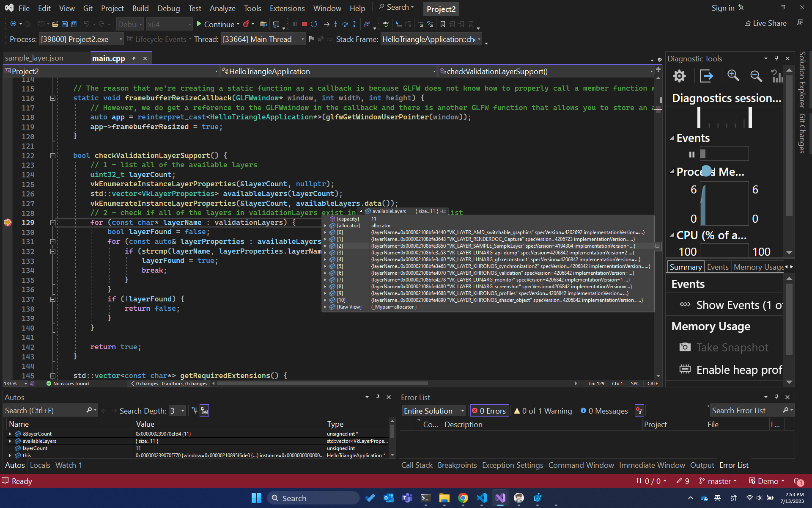
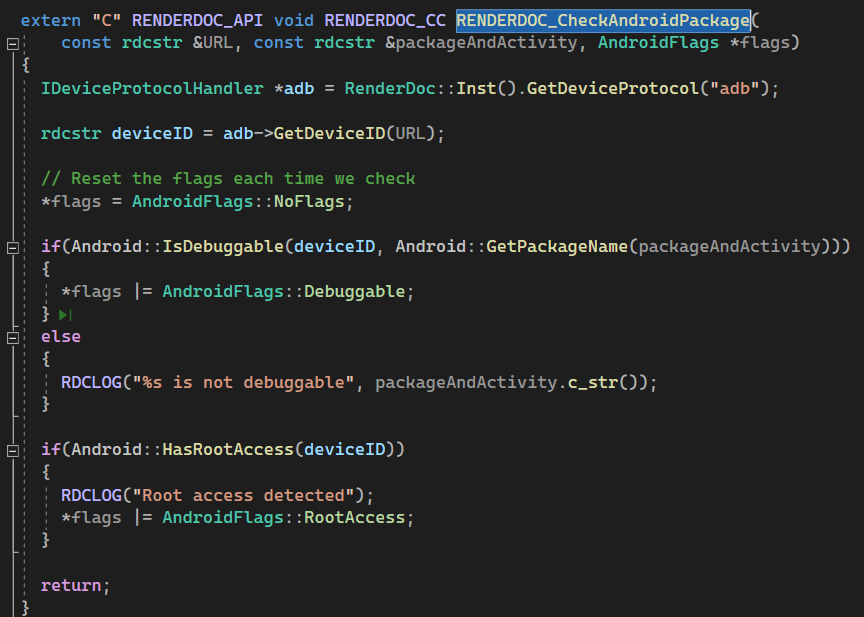

<!--more-->

## LAYER

- 在 windows 中， 层被写在注册表中`HKEY_LOCAL_MACHINE\SOFTWARE\Khronos\Vulkan`，这里可以看到有一个 renderdoc 的 layer 信息


- 当在 Vulkan 应用程序中，执行 `vkCreateInstance` 的时间，会加载 ICD 驱动文件
- 在后续的 loader_scanned_icd_add 调用中，代码从载入的库中获得了`vk_icdGetInstanceProcAddr` 函数指针并创建了入口的函数指针实例

```C++
loader_platform_open_library(const char * libPath)
loader_scanned_icd_add(...)
loader_icd_scan(...)
vkCreateInstance(...)
main()
```

- 整个流程就是，Vulkan Loader 扫描注册表获得相应的 json 文件，载入这个 json 文件，载入 dll，获得入口函数指针，载入相应函数指针。而这个载入过程，通过检查函数调用，也会在`vkEnumerateInstanceExtensionProperties` 等接口中调用。而SDK中的接口，都是对函数指针包了一层，例如 `vkCreateBuffer`，整个`VkLayerDispatchTable` 就是函数指针的集合

```C++
LOADER_EXPORT VKAPI_ATTR VkResult VKAPI_CALL
vkCreateBuffer(VkDevice device, const VkBufferCreateInfo *pCreateInfo,
               const VkAllocationCallbacks *pAllocator, VkBuffer *pBuffer) {
    const VkLayerDispatchTable *disp;

    disp = loader_get_dispatch(device);

    return disp->CreateBuffer(device, pCreateInfo, pAllocator, pBuffer);
}
```

- vulkan 的一个思想就是，去除掉验证层，那么验证层能放在何处？也就是放在这个 SDK 里，类似各种 Graphic Debugger 的实现，Vulkan 有很多Validation Layer，可以根据需求载入，在真正的函数调用之前，截取一些信息，获得一些信息，最后再调用真正的接口。也就是说整个 SDK 不仅仅是一个函数指针获取器，还是一个 Graphic Debugger
- Vulkan是一个层架构，由Vulkan Application+Loader+Layer+ICDs(Installable Client Drivers) 组成，loader 可以插入一系列可选的layers


- layers 是可选组件，可以增强 vulkan 系统，可以拦截，修改 vulkan api，layers 是作为 lib 库实现，可以通过不同方式使能并且在CreateInstance 中被加载。每个 layer 可以选择任何 vulkan api 进行拦截，一个 layer 不需要拦截所有 vulkan api function，layer 可以选择取拦截所有已知 vulkan api，也可以拦截一条 vulkan api。因为layer是可选的，我们可以在调试阶段使能，在release时关闭
- layer的一些示例如下：
    - 校验api使用
    - 增加debug和trace等调试信息
    - 覆盖额外内容
- vulkan 中很多扩展和函数（api）被分成两个主要组，一个是实例 instance 相关对象，另一个是 device 相关对象
- vulkan instance 是一个high-level系统级信息或者函数，vulkan对象如VkInstance和VkPhysicalDevice，vulkan函数如vkEnumerateInstanceExtensionProperties、vkEnumeratePhysicalDevices、vkCreateInstance、vkDestroyInstance等。可以使用vkGetInstanceProcAddr查询vulkan instance function，vkGetInstanceProcAddr可以查询device或者instance入口点，返回的函数指针对实例或者基于实例创建的对象有效，包括vkDevice对象，同理，instance扩展是一系列vulkan实例函数
- vulkan device是一个逻辑标识，别用于在特定physical device关联的api，device object有vkDevice，vkQueue，vkCommandBuffer，任何是前面三个object孩子的dispatchable object。device function一般是将device object作为第一个参数的api，比如vkQueueSubmit、vkBeginComandBuffer、vkCreateEvent等
- 任何 Vulkan function 都可能调用一组不同的模块经过 loader-layers-ICDs，loader 管理调度 Vulkan function 到正确的 layers 和 ICDs，Vulkan 的对象模型允许 loader 将 layers 插入到 call chain，所以可以在调用 ICDs 之前处理掉 Vulkan function
- layers 可以从 app 到 hardware 中拦截、评估和修改现有的 Vulkan functions，layers 被实现为可以以 lib 的形式被启用的库，并在 CreateInstance 期间加载，layer 可以选择 hook 哪些 function
- 要使用 layers 需要明确告知二进制文件的位置和要启用的层，layer 可以分别通过 loader/ application 进行隐式/显式启用，需要创建符合接口规范的 layer 才能让 loader 和 layer 之间正常通信，并且加载过程和 device & platform 都有关系


## Drawing a triangle

- std::vector::data() 是 C++ 中的 STL，它返回一个指向内存数组的直接指针，该内存数组由向量内部用于存储其拥有的元素
- const * 代表指针指向常量； * const 代表常量指针
- 可以用 optional 类型的 variable .has_value() 检查是否有数被设置了，在一些不确定 magic value 的情况下可以检查 isvalid

## RenderDoc

### 如何发现 Layer Settings

- struct VulkanDriverRegistration 先注册上 CheckVulkanLayer、InstallVulkanLayer 方法
- CheckVulkanLayer() 用于检查注册表中是否包含本地 renderdoc.json，主要是通过 ProcessImplicitLayersKey() 方法遍历注册表数据对比
- 如果注册表没有当前条目，UI 上会提示，点击之后会弹出框让你选择


- 点击确认之后会触发 CaptureDialog::vulkanLayerWarn_mouseClick() 方法，会传入参数 `"--install_vulkan_layer"`, `"root"` 并以管理员身份运行当前的可执行文件，这里是 qrenderdoc.exe，应该是捕获了这俩参数然后自动注册了，但是我目前没有在代码中找到。理论上不从这里进去直接跑 exe 带参数就可以直接进行注册了，具体的注册代码逻辑目前不太清楚，因为具体实现和平台有关，这里暂时不深究


- 使用 vkEnumerateInstanceLayerProperties() 枚举 layers 时，确实是能看到注册表下的条目，手动删掉再添加注册表中的 renderdoc.json，能看到枚举出来的 layers 数目确实发生了变化


- 那么将我的 demo layer 手动加入到注册表中试试，哎嘿果然有了，那么说明找 layer 这一层是 vulkan 底层已经自动实现了，并且 layer 的注册方式与平台有关



- 然后我们先实现绑定的 vkGetInstanceProcAddr()，通过宏定义给函数加上前缀，这样可以返回我们自定义的函数。被 extern "C"修饰的变量和函数是按照 C 语言方式进行编译和链接的
- 如果 setting 写错，可以看到 validation layer 可以捕获到这个错误，但是如果路径写对似乎没看到有啥效果？检查了一下发现 .dll 生成得有问题，需要检查一下


- 发现问题在设置 dllexport 时是根据宏 WIN32 来设的，但是因为没有 include <windows.h> 所以并没有真的导出，这下子终于有了，多个独立的 layer 也是可以的


- 但我想直接用 renderdoc 的层出现了一些 device 上的问题，直接用 renderdoc 调试我的 vulkan 程序也有问题。直接用 renderdoc 开问题的解决方式是需要将 SDK 的 API version 设到至少 1.1，改 VkApplicationInfo.apiVersion。改了 version 之后在代码里启用 renderdoc layer 也可以了，但如果开了我的 sample layer 会在 create device 出现问题，返回的函数地址为 null，为什么呢，这些 layer 不应该是独立的吗。遇到两次 layer 的问题似乎都是 function 的位置为 null，所以如何建立这个 chain 还需要重点研究下
- 神奇的是，我调整了一下要开启的 vulkan layer 的顺序，renderdoc 在前，sample layer 在后，就不会报 null 的函数指针了，为什么呢，这个需要研究一下


- 可以看到这里的函数指针确实被改掉了，好神奇，话说我的 layer 不是 .dll 吗，为什么可以直接 debug .cpp？但怪异的是之后又不能打断点调试了。通过打断点会发现，执行到这个 function 之后，会进入 layer 里的 function，直到执行结束返回，才会继续执行原来 application 里的逻辑


- 个人感觉 layer 类似之前做 pipelinetd 的东西，动态加载 .dll 去注册方法，今天来看看 loader 源码看如何实现的，以及要联动多个 layer 应该怎么做，信息如何传递是最好的？再检查一下 renderdoc 的源码的 layer 部分
- 所以要实现自己的 layer，首先需要定义好自己的 GetInstanceProcAddr()，通过比较 pName 决定返回自己要捕获的函数指针，不然就直接返回下一层的函数指针，自己不捕获

## Android Compiling

- RenderDoc 很好编译，下载 MSYS2，然后在命令行中运行，系统变量 Path 需要设一下为 `C:\msys64\mingw64\bin`：

```shell
pacman -S mingw-w64-x86_64-cmake
pacman -S mingw-w64-x86_64-make
pacman -S mingw-w64-x86_64-gcc
pacman -S git

mkdir build-android
cd build-android
cmake -DBUILD_ANDROID=On -DANDROID_ABI=armeabi-v7a -G "MinGW Makefiles" ..
mingw32-make -j20

mkdir build-android64
cd build-android64
cmake -DBUILD_ANDROID=On -DANDROID_ABI=arm64-v8a -G "MinGW Makefiles" ..
mingw32-make -j20
```

- 结果我换了一个 java 版本到最新，jdk-20，就编译不了了，总是说版本是 7 期望是 8
- 终于编译出了 apk，装到了我的手机和平板上测试，但是完全没找到装在哪里了


- Vulkan repo 编译折腾了好久，主要是版本不一致，camke 要求 3.10.3，Android-SDK 要求 26，Build-Tool 是 30.0.2。但这个弄好了之后 renderdoc 编译不了了，报 java 相关的错误。原因找到了，是 cmake 的问题，版本太老了

```shell
./gradlew.bat assembleDebug
```

- Validation-Layers 在编译的时候遇到一点小问题，是因为文件路径含有空格，换了个位置就好了，但是提示我一定要认真看 log

```shell
./update_external_sources_android.bat
ndk-build
```

- Android 上的 log 需要用 <android/log.h>，在电脑上查看需要用 `adb logcat > log.txt`。有意识地犯错，将 Viewport 的 width 设为 0，能看到捕获了错误，发现都有 log


- 可以看到 .so 打包进了 .apk，并且确实是 load 的这个 .so。我试了另一个 demo 下的 apk，打开直接闪退了，推测可能是因为没有找到 .so，因为我只要编译进去了就不会闪退，似乎是在开启回调没有做验证出了一些问题。我刚发现 validation 在这个 application 应该默认是 false 的，但是为什么启用了呢？似乎是因为我设了全局变量强制开启？有点怪


- 如果 apk 本身没有打包，也可以通过下面的命令把 .so 加进去，但我自己的 apk 仍然不会去找，但是 renderdoc 下的 apk 会去找

```shell
adb push libVkLayer_khronos_validation.so /data/local/tmp
adb shell run-as de.saschawillems.vulkanPBRBasic cp /data/local/tmp/libVkLayer_khronos_validation.so .
adb shell run-as de.saschawillems.vulkanPBRBasic ls libVkLayer_khronos_validation.so
```

- 可以检查一下，打包了一个不带 .so 的，但是强制开启 validation，就会闪退，但是我把 .so 移入了 ./lib/ 中，就能正常跑了，也确实是加载了这个 .so。
- 注意 logcat 会把一段时间内系统的历史日志都 dump 下来，要注意看一下时间
- /data/app/~~UeIVxKUqqBLOZDV8kKRzOw==/de.saschawillems.vulkanPBRBasic-mEUgiDgY4NWBHgxCle-v3A==/

/data/app/~~_6SB08YEf6to1Ary-jDMzA==/org.renderdoc.renderdoccmd.arm64-kfpFghz3uGyIJESixbgacg==/lib/arm64


- 观察 .RenderDocCmd.apk，发现它也是将含有 layer 的 librenderdoccmd.so 打包了进去，自己的打包需要新建 src/main/jniLibs 把相关的 .so 按照原来的目录放进去

```shell
jar -xvf *.apk
```


- 查看验证层的输出是自带了 VALIDATION tag 的，但我测试下来并没有看到输出，得再研究一下


- 下载 google git，需要设一下 git 的 proxy，然后 clone 即可

```shell
git config --global http.proxy IP:PORT
git config --global https.proxy IP:PORT
```

- 看到 android 版本编译下的 .so 说没有 vulkan 能识别的入口函数，但是昨天明明还可以的啊 = =，但是 linux 版本的 .so 就可以识别，导出看了一下 linux 版本的 .so 确实看到有入口函数


- 用了一下 windows 版本的 renderdoc，查看它的 .so，它也是正确导出了对应的入口函数的


- 测试发现程序启动后在依次在以下目录寻找 layer


- 但是我自己单独加一个 layer.so 也会被 vulkan 扫描到，根据我的观察 renderdoc 里面并没有设置相关的东西，一种猜测是 vulkan 会去找当前 app 和子进程的所有 lib 文件夹，需要弄明白代码里 adb shell am start 是怎么搞的


- 也许是通过这种方式强制 hook 了，但是同一个目录中的其他 layer 也会自动被扫描到，难道可以 hook 这个目录的东西？


- .o 这些函数是编进去了的


- 指定 cmake 版本需要：

```gradle
android {
    ...
        externalNativeBuild {
            cmake {
                ...
                version "3.26.4"
            }
        }
    }
```

- renderdoc 编译的暂时解决方法是换成 v1.27，但仍然感觉出来的 .so 和官方给的 .so 不太一样，少了很多行。换了一些版本之后，编译的 warning 都少了两条 hh


## RenderDoc

- RenderDoc 调试 Android 设备的第一步，按钮会让选平台是 loca 还是 device，点击之后会先获取安卓支持的 ABI，然后在对应的目录下，找到给安卓打包的 .apk，然后 adb install 打包好的 renderdoc.apk


- 选择一个 app 打开，选择文件名后会进行安卓检测，点击 Launch 按钮会触发回调，进行一系列校验之后会触发 `AndroidRemoteServer::ExecuteAndInject()` 这个方法，首先会找到这个 app 的 processName 并把之前的都关掉，然后设置 layer 的全局变量，关键是这句话：`shell settings put global gpu_debug_layer_app`，指定一个或多个要在其中搜索层的软件包，然后进行一系列检查，看 .so 是否存在，然后用 `shell am start` 启动就好了，vulkan 就会自动去指定的一些目录下寻找 .so




### Android Compiling

- 来看看编译的第一句 `cmake -DBUILD_ANDROID=On -DANDROID_ABI=arm64-v8a -G "MinGW Makefiles" ..`
- `-G "MinGW Makefiles"` 会生成给 `mingw32-make` 用的 makefiles
- `mingw32-make` 和 Linux 中 make 命令有相同的作用
- `-D` 创建或者更新 cmake cache entry，当 CMake 第一次在一个空的构建树中运行时，它会创建一个 `CMakeCache.txt` 文件，并用项目的可定制设置填充它
- `$ENV{VAR}` 获取环境变量 `VAR`，可以通过 `if(DEFINED ENV{<name>})` 检查环境变量是否存在
- `execute_process(COMMAND <cmd1> [<arguments>])` 运行一个子进程命令行
- 找了 java、android adk、android ndk、android.toolchain.cmake，然后需要指明 ndk 需要的一些设置，比如 platform、libc++、clang、android abi 等
- `set` 带 `CACHE` 相当于全局缓存变量
- in-source build 是指在顶层 `CMakeLists.txt` 所在的文件夹直接执行 `cmake PATH`，out-of-source build 是指在非 CMakeLists.txt 目录执行 `cmake PATH`
- `CMAKE_BINARY_DIR`(二进制目标文件目录)，执行 cmake 的目录，即二进制中间目标文件存放位置的顶级目录；`CMAKE_SOURCE_DIR` 是顶层`CMakeLists.txt` 所在的位置
- 设置一些配置参数可以在 cpp 中用的，比如 lib、vulkan setting file、version、name，还会进行 git hash 相关的检测与验证
- windows 上禁用了 cmake，有点怪，得研究一下怎么生成相关的 .sln 的
- `file` 用来读文件，主要会读 `/renderdoc/api/replay/version.h` 来获取一些版本号相关的配置信息，android 会禁用 Opengl、python、Qt
- CMAKE_LIBRARY_OUTPUT_DIRECTORY 编译时 lib 库输出目录，CMAKE_RUNTIME_OUTPUT_DIRECTORY 动态库输出目录，`add_definitions` 可以添加 cpp 能读到的变量，然后设置 Clang 的一些编译选项
- `add_subdirectory` 添加一个子目录并构建该子目录，安卓加了 renderdoccmd、renderdoc 目录
- 在编译 Shared or Module 的之后需要将 `CMAKE_POSITION_INDEPENDENT_CODE` 设置为 ON
- 在 renderdoc/ 下的编译选项，设置了一堆和 Clang 有关的东西，在 line376，没有仔细研究每个项的含义目前
- 有一个小发现，`set(CMAKE_CXX_FLAGS "${CMAKE_CXX_FLAGS} -fvisibility=hidden -fvisibility-inlines-hidden")` ，在设置动态链接库的时候会不导出函数，如果在函数前加上 `__attribute__((visibility("default")))` 就可以导出了，RenderDoc v1.28 之所以不能导出，在于他把 vulkan 相关的函数都 hidden 了，所以就没有了！
- 如果源文件没有做改动，那么就不会重新 link .so


## Android Vulkan Layer

- Vulkan 在枚举 Layers 的时候，首先获得 Trampoline 函数 `vkEnumerateInstanceLayerProperties`，然后获取 layer 信息，所以 `vkEnumerate*` 是一定要在 .so 中导出的


- 找函数入口，会先找 layer 开头的函数，再找 vk 开头的函数，主要需要导出的函数需要加上 `extern "C"`


## Validation Layers

- Validation Layers 似乎把很多 layer 合到了一起，导致 .json 文件长得不太规范，有点难读懂
- LD_LIBRARY_PATH环境变量用于在程序加载运行期间查找动态链接库时指定除了系统默认路径之外的其他路径。注意，LD_LIBRARY_PATH中指定的路径会在系统默认路径之前进行查找

## 小结

## References

- https://github.com/KhronosGroup/Vulkan-ValidationLayers/tree/main
- https://vulkan.lunarg.com/doc/sdk/1.3.250.1/linux/khronos_validation_layer.html
- https://www.cnblogs.com/vertexshader/articles/5225675.html
- https://zhuanlan.zhihu.com/p/584890426
- https://zhuanlan.zhihu.com/p/389646665
- https://www.lunarg.com/tutorial-overview-of-vulkan-loader-layers/
- https://github.com/KhronosGroup/Vulkan-Guide/blob/main/chapters/layers.adoc
- https://zhuanlan.zhihu.com/p/339673291
- https://cylof22.gitbooks.io/vulkan-by-example-for-android/content/chapter1.html
