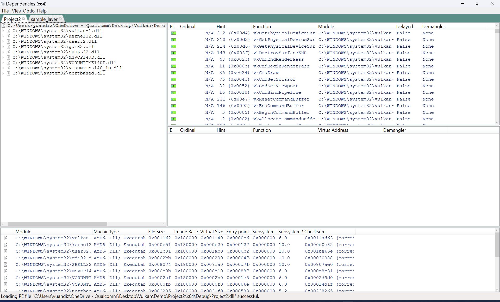

<!--more-->

## LAYER

- 在 windows 中， 层被写在注册表中`HKEY_LOCAL_MACHINE\SOFTWARE\Khronos\Vulkan`，这里可以看到有一个 renderdoc 的 layer 信息


- 当在 Vulkan 应用程序中，执行 `vkCreateInstance` 的时间，会加载 ICD 驱动文件
- 在后续的 loader_scanned_icd_add 调用中，代码从载入的库中获得了`vk_icdGetInstanceProcAddr` 函数指针并创建了入口的函数指针实例

```C++
loader_platform_open_library(const char * libPath)
loader_scanned_icd_add(...)
loader_icd_scan(...)
vkCreateInstance(...)
main()
```

- 整个流程就是，Vulkan Loader 扫描注册表获得相应的 json 文件，载入这个 json 文件，载入 dll，获得入口函数指针，载入相应函数指针。而这个载入过程，通过检查函数调用，也会在`vkEnumerateInstanceExtensionProperties` 等接口中调用。而SDK中的接口，都是对函数指针包了一层，例如 `vkCreateBuffer`，整个`VkLayerDispatchTable` 就是函数指针的集合

```C++
LOADER_EXPORT VKAPI_ATTR VkResult VKAPI_CALL
vkCreateBuffer(VkDevice device, const VkBufferCreateInfo *pCreateInfo,
               const VkAllocationCallbacks *pAllocator, VkBuffer *pBuffer) {
    const VkLayerDispatchTable *disp;

    disp = loader_get_dispatch(device);

    return disp->CreateBuffer(device, pCreateInfo, pAllocator, pBuffer);
}
```

- vulkan 的一个思想就是，去除掉验证层，那么验证层能放在何处？也就是放在这个 SDK 里，类似各种 Graphic Debugger 的实现，Vulkan 有很多Validation Layer，可以根据需求载入，在真正的函数调用之前，截取一些信息，获得一些信息，最后再调用真正的接口。也就是说整个 SDK 不仅仅是一个函数指针获取器，还是一个 Graphic Debugger
- Vulkan是一个层架构，由Vulkan Application+Loader+Layer+ICDs(Installable Client Drivers) 组成，loader 可以插入一系列可选的layers


- layers 是可选组件，可以增强 vulkan 系统，可以拦截，修改 vulkan api，layers 是作为 lib 库实现，可以通过不同方式使能并且在CreateInstance 中被加载。每个 layer 可以选择任何 vulkan api 进行拦截，一个 layer 不需要拦截所有 vulkan api function，layer 可以选择取拦截所有已知 vulkan api，也可以拦截一条 vulkan api。因为layer是可选的，我们可以在调试阶段使能，在release时关闭
- layer的一些示例如下：
    - 校验api使用
    - 增加debug和trace等调试信息
    - 覆盖额外内容
- vulkan 中很多扩展和函数（api）被分成两个主要组，一个是实例 instance 相关对象，另一个是 device 相关对象
- vulkan instance 是一个high-level系统级信息或者函数，vulkan对象如VkInstance和VkPhysicalDevice，vulkan函数如vkEnumerateInstanceExtensionProperties、vkEnumeratePhysicalDevices、vkCreateInstance、vkDestroyInstance等。可以使用vkGetInstanceProcAddr查询vulkan instance function，vkGetInstanceProcAddr可以查询device或者instance入口点，返回的函数指针对实例或者基于实例创建的对象有效，包括vkDevice对象，同理，instance扩展是一系列vulkan实例函数
- vulkan device是一个逻辑标识，别用于在特定physical device关联的api，device object有vkDevice，vkQueue，vkCommandBuffer，任何是前面三个object孩子的dispatchable object。device function一般是将device object作为第一个参数的api，比如vkQueueSubmit、vkBeginComandBuffer、vkCreateEvent等
- 任何 Vulkan function 都可能调用一组不同的模块经过 loader-layers-ICDs，loader 管理调度 Vulkan function 到正确的 layers 和 ICDs，Vulkan 的对象模型允许 loader 将 layers 插入到 call chain，所以可以在调用 ICDs 之前处理掉 Vulkan function
- layers 可以从 app 到 hardware 中拦截、评估和修改现有的 Vulkan functions，layers 被实现为可以以 lib 的形式被启用的库，并在 CreateInstance 期间加载，layer 可以选择 hook 哪些 function
- 要使用 layers 需要明确告知二进制文件的位置和要启用的层，layer 可以分别通过 loader/ application 进行隐式/显式启用，需要创建符合接口规范的 layer 才能让 loader 和 layer 之间正常通信，并且加载过程和 device & platform 都有关系


## Drawing a triangle

- std::vector::data() 是 C++ 中的 STL，它返回一个指向内存数组的直接指针，该内存数组由向量内部用于存储其拥有的元素
- const * 代表指针指向常量； * const 代表常量指针
- 可以用 optional 类型的 variable .has_value() 检查是否有数被设置了，在一些不确定 magic value 的情况下可以检查 isvalid

## RenderDoc

### 如何发现 Layer Settings

- struct VulkanDriverRegistration 先注册上 CheckVulkanLayer、InstallVulkanLayer 方法
- CheckVulkanLayer() 用于检查注册表中是否包含本地 renderdoc.json，主要是通过 ProcessImplicitLayersKey() 方法遍历注册表数据对比
- 如果注册表没有当前条目，UI 上会提示，点击之后会弹出框让你选择


- 点击确认之后会触发 CaptureDialog::vulkanLayerWarn_mouseClick() 方法，会传入参数 `"--install_vulkan_layer"`, `"root"` 并以管理员身份运行当前的可执行文件，这里是 qrenderdoc.exe，应该是捕获了这俩参数然后自动注册了，但是我目前没有在代码中找到。理论上不从这里进去直接跑 exe 带参数就可以直接进行注册了，具体的注册代码逻辑目前不太清楚，因为具体实现和平台有关，这里暂时不深究


- 使用 vkEnumerateInstanceLayerProperties() 枚举 layers 时，确实是能看到注册表下的条目，手动删掉再添加注册表中的 renderdoc.json，能看到枚举出来的 layers 数目确实发生了变化


- 那么将我的 demo layer 手动加入到注册表中试试，哎嘿果然有了，那么说明找 layer 这一层是 vulkan 底层已经自动实现了，并且 layer 的注册方式与平台有关


- 然后我们先实现绑定的 vkGetInstanceProcAddr()，通过宏定义给函数加上前缀，这样可以返回我们自定义的函数。被 extern "C"修饰的变量和函数是按照 C 语言方式进行编译和链接的
- 如果 setting 写错，可以看到 validation layer 可以捕获到这个错误，但是如果路径写对似乎没看到有啥效果？检查了一下发现 .dll 生成得有问题，需要检查一下




- 发现问题在设置 dllexport 时是根据宏 WIN32 来设的，但是因为没有 include <windows.h> 所以并没有真的导出，这下子终于有了，多个独立的 layer 也是可以的，但我想直接用 renderdoc 的层出现了一些 device properties 上的问题


- 个人感觉 layer 类似之前做 pipelinetd 的东西，动态加载 .dll 去注册方法，今天来看看 loader 源码看如何实现的，以及要联动多个 layer 应该怎么做，信息如何传递是最好的？再检查一下 renderdoc 的源码的 layer 部分


## 小结

## References

- https://github.com/KhronosGroup/Vulkan-ValidationLayers/tree/main
- https://vulkan.lunarg.com/doc/sdk/1.3.250.1/linux/khronos_validation_layer.html
- https://www.cnblogs.com/vertexshader/articles/5225675.html
- https://zhuanlan.zhihu.com/p/584890426
- https://zhuanlan.zhihu.com/p/389646665
- https://www.lunarg.com/tutorial-overview-of-vulkan-loader-layers/
- https://github.com/KhronosGroup/Vulkan-Guide/blob/main/chapters/layers.adoc