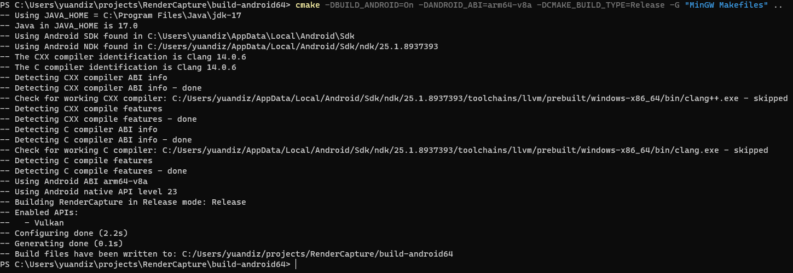

# 使用 VK_LAYER_RenderCapture

## 1. 将 layer 和配置文件拷贝到正确的目录下

```shell
# 拷贝 layer 和配置文件到手机文件系统下
adb push ./libVkLayer_RenderCapture.so /data/local/tmp
adb push ./setting.json /data/local/tmp

# 拷贝 layer 到游戏的 lib/arm64/ 目录下
cp /data/local/tmp/libVkLayer_RenderCapture.so ${game_lib_folder}
# e.g.
cp /data/local/tmp/libVkLayer_RenderCapture.so /data/app/~~U-65uUgirPlu7cUYNx8c0w==/com.miHoYo.hkrpg-jGSsgdzSUJiYDe4YUNByIA==/lib/arm64/
```

## 2. 开启 layer 和 Perfetto

```shell
# 开启 layer
adb shell setprop debug.vulkan.layers VK_LAYER_RenderCapture

# 开启 Perfetto
adb shell setprop persist.traced.enable 1
```

## 3. 使用 layer 和 Perfetto

```shell
# layer 会自动被 vulkan 识别和加载

# 使用 Perfetto 
adb shell perfetto -o ${perfetto_output_path} -t ${time} -a ${game_name}
# e.g.
adb shell perfetto -o /data/misc/perfetto-traces/trace_file.perfetto-trace -t 60s -a com.miHoYo.hkrpg
```

## 4. 读取 Perfetto 的数据

```shell
# 拉取文件并使用 https://ui.perfetto.dev/ 或者其他方式读取
adb pull ${perfetto_output_path} ${path}
# e.g.
adb pull /data/misc/perfetto-traces/trace_file.perfetto-trace ./
```

## 5. 读取 layer dump 的数据

```shell
# 查看 layer 存放 dump 数据的文件夹
ls -l /sdcard/Android/data/${game_name}/files/RenderCapture/
# e.g.
ls -l /sdcard/Android/data/com.miHoYo.hkrpg/files/RenderCapture/

# 找到文件夹名字上时间最新的一个文件夹，即为最新一次测试产生的 dump 数据，可以拉取到 PC 上读取
adb pull /sdcard/Android/data/${game_name}/files/RenderCapture/${time_DUMP folder}/ ${path}
# e.g.
adb pull /sdcard/Android/data/com.miHoYo.hkrpg/files/RenderCapture/20230817104449_DUMP/ ./
```

# 配置文件说明

```json
{
    "SYSTRACE": {
        "TRACE_TYPE": "TRACELIST"/"TRACEALL", // "TRACELIST" 表示只 trace "TRACE_LIST" 里面的函数；"TRACEALL" 表示 trace 所有的 Vulkan API
        "TRACE_LIST": [ // 在 "TRACE_TYPE" 为 "TRACELIST" 时会被读取，用来指定需要 trace 哪些函数，需要写全函数名字并且带上 "()"
            "vkCmdDrawIndexed()",
            "vkCreateInstance()",
            "vkCreateGraphicsPipelines()"
        ]
    },
    "HOOK": {
        "ENABLED": false/true // 是否打开 layer 中的 draw call 分析功能，避免分析功能影响实际的 Vulkan API 执行时间。true - 打开；false - 关闭
    }
}
```

# DUMP 文件说明

- `DUMPAPI` 文件夹下记录的是 Vulkan API 被调用的时间
- `DUMPDRAWCALL` 文件夹下记录的是 draw call 的统计数据，统计了每个 renderpass 和 drawcall 的顶点数量
- `DUMPPIPELINESTATE` 文件夹下记录的是每次创建 GraphicsPipeline 时设置的 Depth、Stencil、ColorBlend 的参数
- `DUMPALL` 文件夹下把上述三种数据记录在了一起，方便查看执行的先后顺序

# 测试 & 编译环境（参考）

不能确保在所有版本和机器上都能使用，我使用的测试机：

- Model: Taro for arm64
- Android version: 12

编译环境：

- Java 17.0
- Android NDK 25.1.8937393
- Android ABI arm64-v8a
- Android native API level 23


