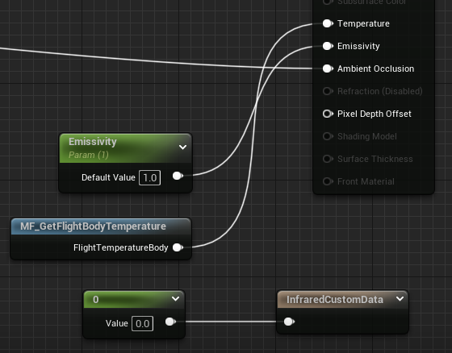

<!--more-->

## Build From Source Code

### 下载仓库并设置

- Fork UnrealEngine 原仓库
- `git clone --branch 5.3 https://github.com/Zydiii/UnrealEngine`
- 检查远程仓库 `git remote -v`
- 设置上游仓库 `git remote add upstream https://github.com/EpicGames/UnrealEngine.git`
- 检查确认 `git remote -v`，应当看到 origin 和 upstream
  
  ```shell
    origin  https://github.com/Zydiii/UnrealEngine (fetch)
    origin  https://github.com/Zydiii/UnrealEngine (push)
    upstream        https://github.com/EpicGames/UnrealEngine.git (fetch)
    upstream        https://github.com/EpicGames/UnrealEngine.git (push)
  ```

### 更新，保持和上游分支同步 ⭐⭐⭐

❗❗❗ 每天修改前都进行以下操作防止与上游仓库差异过大（如果需要和上游保持更新的话就这样操作，否则就固定此版本不要动）❗❗❗ 

- `git status` 检查本地是否有修改
- 提交本地修改

  ```shell
    git add -A 或者 git add filename
    git commit -m "your note"
    git push origin "5.3"
  ```

- `git status` 再次检查确认是否有未提交的修改
- 抓取上游分支的更新 `git fetch upstream`
- 切换分支 `git checkout "5.3"`
- 合并上游分支 `git merge upstream/5.3`
- 提交修改 `git push`

### 插件及编辑器设置

- 商城下的插件 `D:\ProgramFiles\UE_5.3\Engine\Plugins\Marketplace` 粘贴到源码版的相同目录下

### 相关设置

- RenderDoc Plugin 打开，在 Project Setting 找到 RenderDoc 相关设置，勾上第一个 StartUp，设置 RenderDoc 文件夹
- Editor Setting 语言也顺便改一下，不喜欢用中文

### 构建项目

- `cd UnrealEngine`
- `Setup.bat`
- `GenerateProjectFiles.bat`
- 打开 `UE5.sln`，目前用的 VS 2022
- 选择 `Development Editor`、`Win64`，`Ctrl+B` 开始编译
- 编译好之后设置 `Engine/UE5` 为启动项并运行

## Infrared Logic

- [Infrared Logic 0](2023-11-20-FinalProj5.md)
- [Infrared Logic 1](2023-11-20-FinalProj6.md)
- 添加 GBuffer `4ad8c85298954822bf07d8d98a87f635c6c78aba`
- 添加 Shading Model，设置 Pass `097a0eca6c55edb936e43d2a49140b1d53b2184f` 
- 修改 Custom Depth Pixel Shader `05abc28eb985110cc5fd4176e2a3ab34601f86ee`
- 设置 CustomDepth 的混合写入 `3fd397fdab97753bb6678196509cb737ef0f06aa`

## 如何进行飞机的红外仿真（双实体+温度计算+材质）？

- 设置飞机的速度 `AInfraredSimulator::UpdateFlighterMaterialParameter()`，利用材质参数 `UKismetMaterialLibrary::SetScalarParameterValue` 来传递逻辑信息中的数据到材质中，这里设置飞机的速度 `FlightMa`
- 计算飞机的温度 `MF_GetFlightBodyTemperature` `return T_b*(1+0.164*pow(Ma, 2));`
- 计算出来的温度、预设的发射率、种类传递给材质参数




## 小结


## References

- [Github进行fork后如何与原仓库同步](https://github.com/selfteaching/the-craft-of-selfteaching/issues/67)